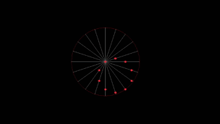

> A programming to visualize what I would call: the dots moving along its straight line but not the circle itself but the dots.

## References

[Circle Illusion - Moving dots to rotating circle](https://www.mathworks.com/matlabcentral/fileexchange/90591-circle-illusion-moving-dots-to-rotating-circle)

[Beautiful Trigonometry - Numberphile](https://www.youtube.com/watch?v=snHKEpCv0Hk&t=159s)

[unit circle](unit_circle.png)

## Output

