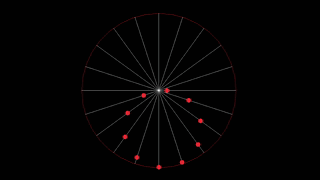

# A programming to visualize what I would call: the dots are moving around the circle but not the circle itself but the dots

## References

[Circle Illusion - Moving dots to rotating circle](https://www.mathworks.com/matlabcentral/fileexchange/90591-circle-illusion-moving-dots-to-rotating-circle)

## Output

